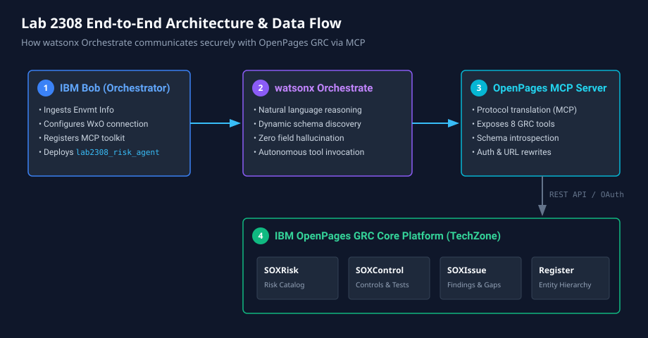
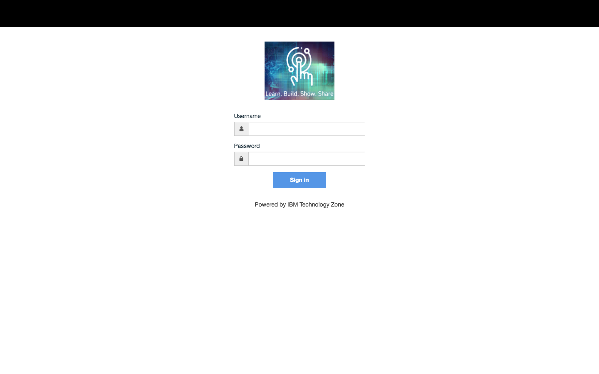
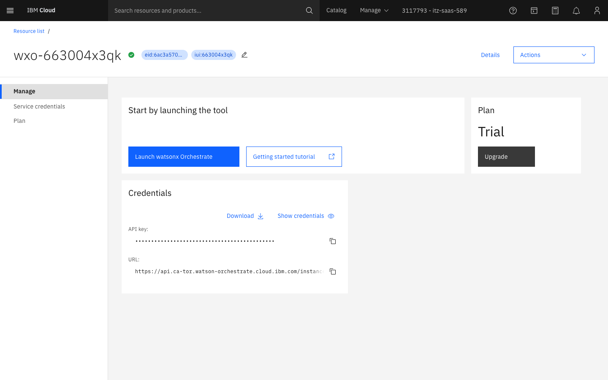
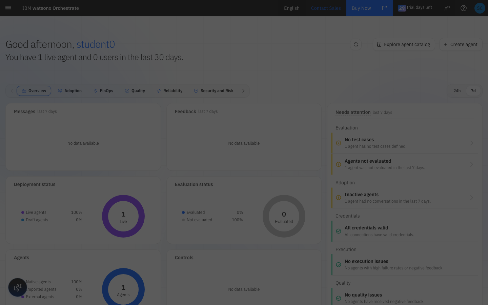
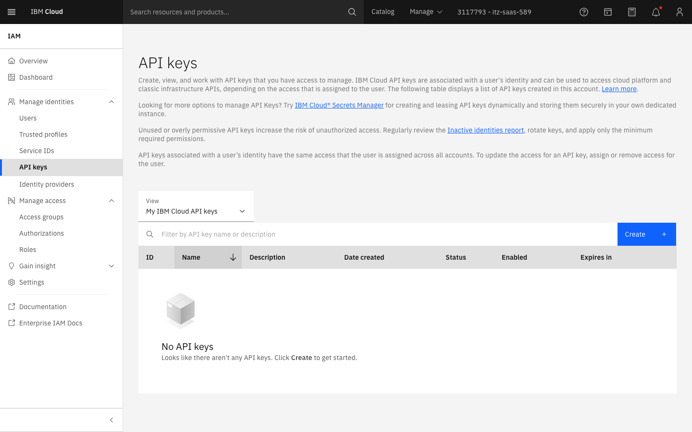
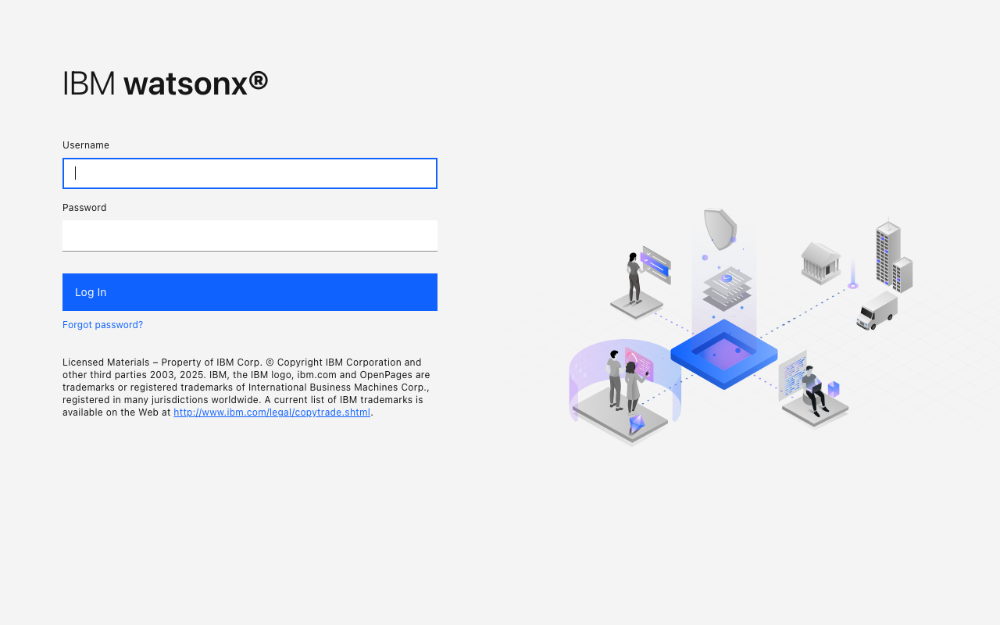
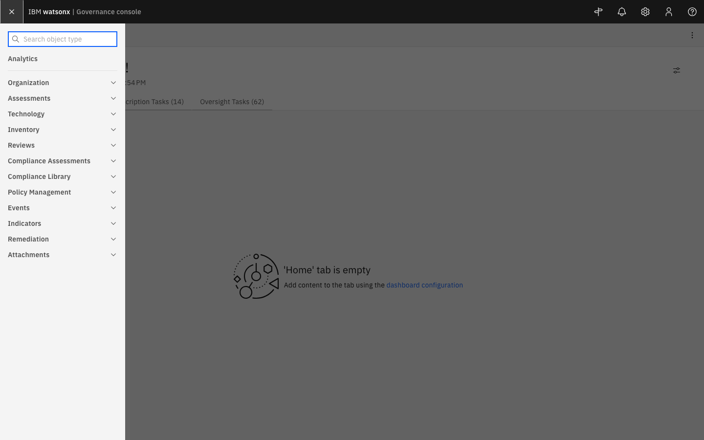
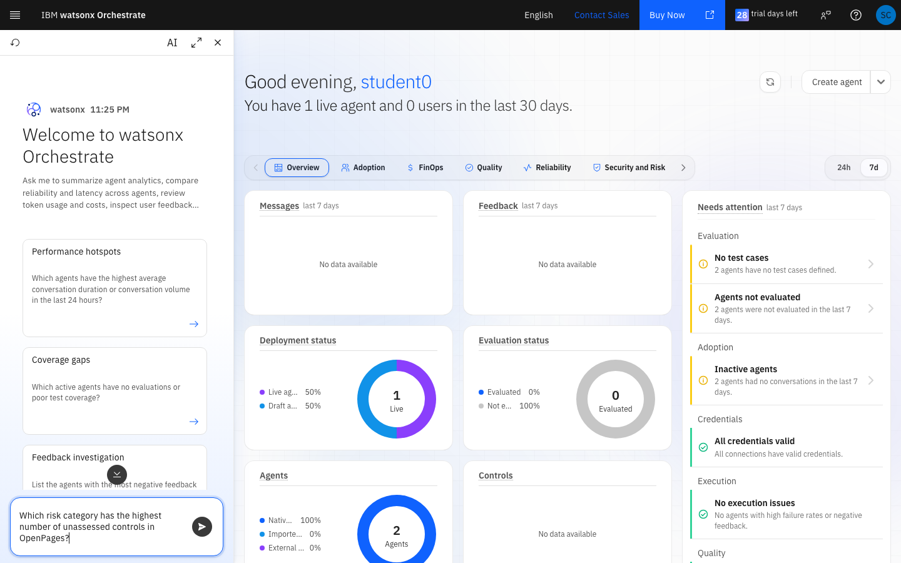
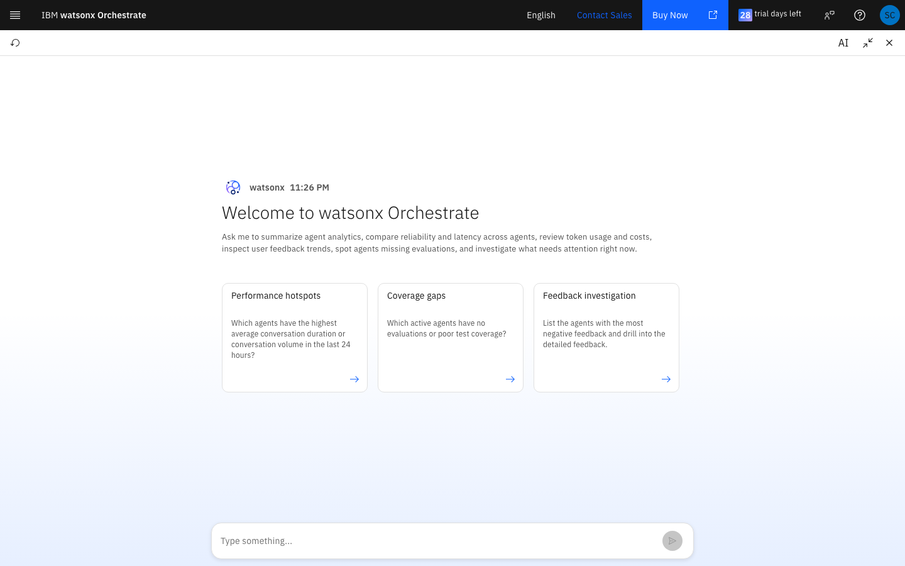

# IBM TechXchange 2026 — Lab 2308
# Build an Autonomous Risk & Compliance Agent Across the IBM Stack

---

## Notices and Disclaimers

© 2026 International Business Machines Corporation. No part of this document may be reproduced or transmitted in any form without written permission from IBM.

U.S. Government Users Restricted Rights — use, duplication or disclosure restricted by GSA ADP Schedule Contract with IBM.

IBM, the IBM logo, and ibm.com are trademarks of International Business Machines Corporation, registered in many jurisdictions worldwide. A current list of IBM trademarks is available at [www.ibm.com/legal/copytrade.shtml](https://www.ibm.com/legal/copytrade.shtml).

*IBM TechXchange 2026 / © 2026 IBM Corporation*

---

## Table of Contents

| Section | Title |
|---------|-------|
| **1** | **Introduction** |
| 1.1 | About This Lab |
| 1.2 | Key Terms & Concepts |
| 1.3 | Lab Objectives |
| **2** | **Architecture Overview** |
| **3** | **Your Lab Environments & Credentials Walkthrough** |
| 3.1 | Environment Credentials Reference Table |
| 3.2 | Step 1: Log In to IBM Cloud via TechZone App ID |
| 3.3 | Step 2: Access Your Resources & watsonx Orchestrate Instance |
| 3.4 | Step 3: Locating Your Service ID API Key for Bob |
| 3.5 | Step 4: Accessing & Logging In to OpenPages (watsonx.governance) |
| **4** | **Module 1 — Start Here: Talk to Bob** |
| 4.1 | Open IBM Bob |
| 4.2 | Bob Sets Everything Up |
| **5** | **Module 2 — Explore OpenPages** |
| 5.1 | Log In to OpenPages |
| 5.2 | Navigate the Risk Register |
| **6** | **Module 3 — Chat With Your Risk Agent** |
| 6.1 | Open the Agent in watsonx Orchestrate |
| 6.2 | Guided Test Prompts |
| 6.3 | What the Agent Is Doing |
| **7** | **Module 4 — Inspect Live Telemetry & Execution Traces** |
| 7.1 | Open the Agent Telemetry & Debug Inspector |
| 7.2 | Anatomy of an MCP Execution Trace |
| 7.3 | Try Your Own Prompts & Watch the Traces |
| **8** | **Troubleshooting** |
| **9** | **Wrap-Up & Feedback** |
| **10** | **Reference** |

---

## 1 Introduction

### 1.1 About This Lab

GRC teams spend hours reading dashboards, chasing risk owners, and manually cross-referencing registers. What if an AI agent could answer questions about your risk posture — in plain English — by talking directly to your GRC system?

In this lab you will build exactly that: an **autonomous AI risk agent** powered by **IBM watsonx Orchestrate** that communicates with **IBM OpenPages** through the **OpenPages Model Context Protocol (MCP) server**.

The best part: **you don't write a single line of code, and you don't touch a terminal.** You simply tell IBM Bob what you need, and Bob handles every bit of wiring behind the scenes. By the time you walk into the watsonx Orchestrate UI, your agent is already built, connected, and ready to chat.

---

### 1.2 Key Terms & Concepts

**IBM OpenPages**
IBM's GRC platform for managing operational risk, compliance, internal audit, and policy. Risk records (*SOXRisk*), controls (*SOXControl*), and issues (*SOXIssue*) live here.

**IBM watsonx Orchestrate (WxO)**
An agentic AI platform. Agents use natural language to plan actions and call tools. WxO handles reasoning, tool selection, and response generation automatically.

**Model Context Protocol (MCP)**
An open standard for exposing tools to AI agents. The IBM OpenPages MCP server wraps the entire OpenPages REST API as callable MCP tools — so a WxO agent can query risks, read schemas, and create records with no custom integration code.

**IBM Bob**
Your AI development assistant for this lab. Bob has a special skill loaded for Lab 2308 — when you tell him you're starting the lab and share your environment details, he silently wires up your entire agent stack, then hands you off to the WxO UI to start chatting.

---

### 1.3 Lab Objectives

By the end of this lab you will be able to:

1. Explain how MCP bridges AI agents and enterprise GRC systems.
2. Describe the schema-first query pattern that prevents AI field-name hallucination.
3. Query live OpenPages risk data through a watsonx Orchestrate agent in natural language.
4. Trace the tool calls an agent makes to satisfy a user request.

---

## 2 Architecture Overview



```
┌──────────────────────────────────────────────────────────────┐
│  Your Browser                                                 │
│                                                               │
│  ┌──────────────────────────────────────────────────────┐    │
│  │  watsonx Orchestrate Chat UI                          │    │
│  └─────────────────────┬────────────────────────────────┘    │
│                        │  natural language                    │
│                        ▼                                      │
│  ┌──────────────────────────────────────────────────────┐    │
│  │  lab2308_risk_agent                                   │    │
│  │  • Reads OpenPages schema before every query          │    │
│  │  • Never guesses field names                          │    │
│  │  • Rewrites internal Docker URLs automatically        │    │
│  └─────────────────────┬────────────────────────────────┘    │
│                        │  MCP tool calls                      │
└────────────────────────┼─────────────────────────────────────┘
                         │
             ┌───────────▼──────────────────┐
             │  OpenPages MCP Server         │
             │  (running in your TechZone)   │
             │  8 tools exposed via MCP      │
             └───────────┬──────────────────┘
                         │  OpenPages REST API
                         ▼
             ┌──────────────────────────────┐
             │  IBM OpenPages GRC            │
             │  SOXRisk · SOXControl ·       │
             │  SOXIssue · Register          │
             └──────────────────────────────┘
```

**What Bob does behind the scenes (invisible to you):**
- Installs the watsonx Orchestrate ADK
- Registers your OpenPages environment as an MCP toolkit in WxO
- Builds and imports the risk agent with your environment's URLs baked in

---

## 3 Your Lab Environments & Credentials Walkthrough

This lab bridges two cloud environments:
1. **IBM watsonx Orchestrate (WxO)** — where your AI agent reasons and executes tool calls.
2. **IBM watsonx.governance / OpenPages (WxGov)** — your GRC platform containing live risks and controls.

> ⚠️ **IMPORTANT: Always Use a Private / Incognito Window**
> Use a clean **Private / Incognito browser window** for accessing IBM Cloud and watsonx Orchestrate to prevent single sign-on conflicts with personal or corporate IBM IDs.

---

### 3.1 Environment Credentials Reference Table

Refer to your reservation's `Envmt Info` handout for your specific credentials. Here is the format breakdown:

| Resource / Parameter | Format / Placeholder Pattern | Active Lab Example (from `Envmt Info`) | Purpose |
|---|---|---|---|
| **IBM Cloud Authorize URL** | `https://cloud.ibm.com/authorize/<tenant_id>/<slug>` | *Provided in your `Envmt Info`* | Direct App ID login gateway |
| **App ID Username** | `student<N>@<tenant_id>.techzone.com` | *Provided in your `Envmt Info`* | Assigned student login username |
| **App ID Password** | `•••••••••••••••` | *Provided in your `Envmt Info`* | Student password from `Envmt Info` |
| **Resource Group** | `eid-<tenant_id>` | *Provided in your `Envmt Info`* | Target resource group in IBM Cloud |
| **Service ID API Key** | `<alphanumeric_api_key>` | *Provided in your `Envmt Info`* | Key given to Bob to configure Orchestrate |
| **IBM Cloud Resources** | `https://cloud.ibm.com/resources` | `https://cloud.ibm.com/resources` | Lists your Cloud instances |
| **OpenPages Application URL** | `https://wxgov-govconsole-demo-<reservation_id>.vsi.techzone.ibm.com/openpages` | Provided in your lab handout / reservation | GRC Web UI for inspecting risks |
| **OpenPages MCP Server URL** | `https://wxgov-govconsole-demo-<reservation_id>.vsi.techzone.ibm.com/mcp` | `<Your OpenPages App URL>` with `/openpages` replaced by `/mcp` | MCP endpoint given to Bob in Module 1 |
| **OpenPages Login Credentials** | `Username` / `Password` | *Ask your lab instructors for credentials* | GRC login credentials |

---

### 3.2 Step 1: Log In to IBM Cloud via TechZone App ID



1. Open a **Private/Incognito** browser window.
2. Paste the **App ID Cloud Directory URL** from your `Envmt Info`:
   ```text
   https://cloud.ibm.com/authorize/<tenant_id>/<slug>
   ```
3. Enter your student credentials from `Envmt Info`:
   - **Username**: `student<N>@<tenant_id>.techzone.com`
   - **Password**: *(Your student password)*
4. Click **Sign in**.

---

### 3.3 Step 2: Access Your Resources & Launch watsonx Orchestrate

1. In IBM Cloud, open your **Resource List** (`https://cloud.ibm.com/resources`) and expand **AI / Machine Learning**, or click into your provisioned **watsonx Orchestrate** service instance:



2. On the service instance overview page (shown above), click the blue **Launch watsonx Orchestrate** button.
3. You will be authenticated directly into your live **IBM watsonx Orchestrate workspace** dashboard:



4. Here you can see your active agents, deployment status, and the floating **AI Chat trigger** in the bottom-left corner to converse with your agent.

---

### 3.4 Step 3: Locating Your Service ID API Key for Bob



When Bob sets up your agent in **Module 1**, he will ask for your **watsonx Orchestrate API Key**:

1. In your `Envmt Info` file, copy your **Service ID API Key**:
   ```text
   <your-service-id-api-key>
   ```
2. You can also view and verify your keys in IBM Cloud under **Manage $\rightarrow$ Access (IAM) $\rightarrow$ API keys** (shown above) or **Service IDs** ([`Service IDs view`](assets/screenshots/real-cloud-serviceids.png)).
3. Keep this key ready to paste when Bob prompts you in Module 1.

---

### 3.5 Step 4: Accessing & Logging In to OpenPages (watsonx.governance)



1. Locate your **OpenPages Application URL** provided in your lab reservation / handout:
   ```text
   https://wxgov-govconsole-demo-<reservation_id>.vsi.techzone.ibm.com/openpages
   ```
2. Open this URL in your browser and **Handle the Browser Security Warning**:
   Because TechZone sandbox instances use a self-signed TLS certificate, your browser will show a warning (*"Your connection is not private"*).
   - Click **Advanced**.
   - Click **Proceed to wxgov-govconsole... (unsafe)**.
3. You will reach the **IBM watsonx OpenPages Login portal** (shown above):
   - **Username & Password**: *Ask your lab instructors for credentials*
4. Click **Log In**.
5. **Derive your MCP Server URL**:
   The MCP server endpoint is simply your OpenPages Application URL with the trailing `/openpages` changed to `/mcp`:
   ```text
   Application URL: https://wxgov-govconsole-demo-<reservation_id>.vsi.techzone.ibm.com/openpages
   MCP Server URL:  https://wxgov-govconsole-demo-<reservation_id>.vsi.techzone.ibm.com/mcp
   ```
   *(This MCP Server URL is what you will provide to Bob in Module 1).*

> ⚠️ **Shared tenant reminder:** Multiple attendees share this WxO instance. Please only create or modify assets named `lab2308_*`. Do not delete other attendees' agents or toolkits.

---

## 4 Module 1 — Start Here: Talk to Bob

**⏱ ~10 minutes**

This is where the magic happens. You will have a short conversation with Bob, share your environment details, and Bob will set up your entire agent stack while you watch.

### 4.1 Open IBM Bob

Open IBM Bob in your browser. Bob should already be running — your lab instructor will confirm the URL.

### 4.2 Bob Sets Everything Up

Type this to start:

```
Hi Bob! I'm in Lab 2308 at TechXchange. Can you set me up?
```

Bob will greet you and ask for three things — one at a time:

1. **Your OpenPages MCP endpoint URL**
   This is your OpenPages Application URL with `/openpages` replaced by `/mcp` (e.g. `https://wxgov-govconsole-demo-<reservation_id>.vsi.techzone.ibm.com/mcp`).

2. **Your watsonx Orchestrate API key**
   Your lab instructor will have given you this, or it's in your TechZone reservation.

3. **Your WxO instance URL** *(Bob will suggest the shared one — just confirm)*

Once you confirm your details, Bob will say something like *"Give me a moment while I wire everything up..."* — and then silently:
- Connects to your WxO instance
- Registers an OpenPages MCP toolkit pointing at your TechZone environment
- Builds and imports your personalised risk agent

When Bob says **"🎉 You're all set!"**, your agent is live. Move on to Module 2.

> **If Bob asks you to run a single terminal command:** This only happens if one step needs a quick manual assist. Copy and paste the command exactly as Bob gives it, run it, then tell Bob "done" and he'll continue.

---

## 5 Module 2 — Explore OpenPages

**⏱ ~10 minutes**

Before chatting with the agent, spend a few minutes in the source system it will be querying.

### 5.1 Log In to OpenPages

1. Open your OpenPages URL (the one provided by your instructor — ending in `/openpages`).
2. Log in with the credentials provided (*Ask your lab instructors for credentials*).
3. Accept the browser security warning for the self-signed certificate (click **Advanced → Proceed**).

### 5.2 Navigate the Risk Register



1. In the top-left corner, click the **Navigation Menu** (hamburger icon, shown above).
2. In the search box or categories, locate the Risk register under **Assessments** or **Organization**.
3. Notice the **Resource ID** format (e.g. `I01-RSK-01-01`). This is how the agent references individual risks.
4. Click into any risk record and look at the field names — notice they use prefixes like `OPSS-Rsk:Status`, `OPSS-Rsk:RiskLevel`. Your agent reads the schema at runtime to get these exact names — it never guesses.

---

## 6 Module 3 — Chat With Your Risk Agent

**⏱ ~25 minutes**



### 6.1 Open the Agent in watsonx Orchestrate

1. Navigate to your **watsonx Orchestrate** instance in IBM Cloud (or open the Orchestrate launch URL authenticated via your reservation).
2. In the Orchestrate workspace, click the **AI Assistant** icon in the bottom-left corner of the window (or the chat launcher).
3. The interactive conversation drawer opens, connected directly to your workspace tools and the `lab2308_risk_agent` agent logic.

---

### 6.2 The Scenario: Find the Gap, Log the Risk, Link the Control

You are a risk analyst at a financial services firm. Every control in this environment is sitting at **"Awaiting Assessment"** — meaning no risk category has confirmed coverage. Your job:

1. **Find** which risk category is most exposed
2. **Log** a new risk in OpenPages to capture the gap
3. **Link** an existing control to the new risk to begin closing it

Work through the four prompts below in order.

---

#### Prompt 1 — Find the compliance gap

```
Which of our risk categories have controls that are still awaiting assessment?
Show me a breakdown by category with counts.
```

**What the agent does:**
- Reads the SOXRisk and SOXControl schemas (schema-first, every time)
- Queries all controls and checks their `OPSS-Ctl:Status` field
- Groups by risk category and counts unassessed controls per category

**What you'll see:** A markdown table of risk categories alongside how many controls are still "Awaiting Assessment" — every single one, which is your gap.

---

#### Prompt 2 — Name the biggest exposure

```
Which risk category is most exposed? Summarise the gap in one paragraph.
```

**What the agent does:**
- Identifies "Clients, Products and Business Practices" as the top category by volume
- Writes a plain-English gap statement

**What you'll see:** A concise paragraph you could drop straight into a risk report.

---

#### Prompt 3 — Log a new risk for the gap

```
Log a new risk called "Unassessed Control Coverage — Client Products" in the
"Clients, Products and Business Practices" category. Add a description that
explains the compliance gap we just found.
```

**What the agent does:**
- Calls `openpages_upsert_object` with the correct field names from the schema
- Places the risk under the Retail Banking business entity
- Returns the new Resource ID and a clickable link

**What you'll see:**
```
✅ Created: Unassessed Control Coverage — Client Products (Resource ID: XXXXX)
View in OpenPages: https://wxgov-govconsole-demo-2ho7021k.vsi.techzone.ibm.com/...
```

> **Verify it live:** Click the link — you'll land directly on the new record in OpenPages. It's real data in the system.

---

#### Prompt 4 — Link a control to close the loop

```
Find a control related to client products and link it to the risk we just created.
```

**What the agent does:**
- Queries SOXControl records and picks a relevant one
- Calls `openpages_associate_objects` to create a Parent/Child relationship
- Returns the linked control name and a verification link

**What you'll see:**
```
✅ Linked: CTL-04-03-03-01 → Unassessed Control Coverage — Client Products
View control in OpenPages: https://wxgov-govconsole-demo-2ho7021k.vsi.techzone.ibm.com/...
```

> **Verify it live:** Open the new risk record in OpenPages → **Controls** tab. The linked control appears there.

---

### 6.3 What the Agent Is Doing

Every response follows this sequence — invisible to you, but critical to why it works reliably:

```
Your message
    │
    ▼
1. get_resource("openpages://catalog/object_types")  ← What types exist?
    │
    ▼
2. get_resource("openpages://schema/SOXRisk")         ← What fields does this type have?
    │
    ▼
3. execute_openpages_query(SELECT confirmed fields…)  ← Query with verified field names only
    │
    ▼
4. Rewrite any internal opapp:10108 URLs             ← Clean up for display
    │
    ▼
5. Format and respond
```

This **schema-first pattern** is what separates a reliable enterprise AI agent from one that occasionally invents field names and returns errors. The schema check costs one extra tool call but eliminates an entire class of AI failure.

---

## 7 Module 4 — Inspect Live Telemetry & Execution Traces

**⏱ ~15 minutes**

In enterprise AI systems, observing *why* an agent made a decision and *how* it retrieved external data is critical for compliance and trust. watsonx Orchestrate provides real-time execution observation and context tracking for every agent interaction.



---

### 7.1 Open the Agent Telemetry & Context Inspector

1. In the **watsonx Orchestrate** chat drawer, click the **Maximize Chat** button or **AI / Info** icon in the header to expand the full execution view (shown above).
2. Observe the conversational context and tool actions as prompts are sent to OpenPages GRC.
3. As the agent plans and communicates with OpenPages via MCP, tool requests, schema lookups, and query responses are tracked in real time.

---

### 7.2 Anatomy of an MCP Execution Trace

Each interaction in the trace inspector is broken down into structured execution spans:

| Span Type | Component | What It Reveals in the Trace |
|---|---|---|
| **TOOL (Schema Discovery)** | `openpages_get_resource` | The exact URI (`openpages://schema/SOXControl`) requested to introspect object fields before generating queries. |
| **TOOL (Data Query)** | `execute_openpages_query` | The exact SQL/REST query payload sent over MCP, execution duration (ms), HTTP status (200 OK), and row count. |
| **TOOL (Write / Association)** | `openpages_upsert_object` | The mutation payload sent to OpenPages, parent process ID binding, and the returned primary `resource_id`. |
| **LLM SPAN (Reasoning & Synthesis)** | `llama-3-3-70b-instruct` | ReAct reasoning steps, prompt/completion token counts, inference latency, and final response formatting. |

> 🔍 **Why This Matters:**
> Notice how the agent NEVER guessed field names like `status` or `risk_level`. The trace proves that `openpages_get_resource` was called first, ensuring field names (`OPSS-Ctl:Status`, `OPSS-Shared-Basel:Risk Category`) were 100% verified against the live OpenPages schema before the query executed.

---

### 7.3 Try Your Own Prompts & Watch the Traces

Pick at least two:

```
How many risks are currently in an Open status?
```

```
List risks that are High severity.
```

```
What controls are available in OpenPages?
```

```
Summarise the risk landscape — how many risks exist per status?
```

```
Which business entity has the most open risks?
```

For each, watch the trace. Ask yourself:
- Did the agent read the schema before querying?
- Are the field names in the query prefixed correctly (e.g. `OPSS-Rsk:Status`)?
- Do all links in the response point to your TechZone hostname?

---

## 8 Troubleshooting

**If something isn't working right, just tell Bob.** Bob has full visibility into your setup and can silently re-run any step. Example:

```
Bob, my risk agent isn't returning any results. Can you check the connection?
```

Bob will diagnose and fix it quietly.

---

**Common issues and what to say to Bob:**

| What you see | What to tell Bob |
|---|---|
| Agent says "I don't have access to that tool" | "Bob, my agent says it can't find the MCP tools. Can you re-register the toolkit?" |
| Responses time out | "Bob, the agent is timing out. Can you check the OpenPages endpoint?" |
| Auth error / 401 | "Bob, I'm getting an authentication error. Can you refresh the connection?" |
| No risks returned | "Bob, the agent returned an empty list. My OpenPages URL is `<paste URL>`." |

---

## 9 Wrap-Up & Feedback

### What You Built

✅ An AI risk agent connected live to IBM OpenPages via MCP  
✅ Schema-first query behaviour — zero field-name hallucination  
✅ Natural language interface over a real GRC system  
✅ End-to-end tracing of agent tool calls  

### What Comes Next

Today's lab covers end-to-end risk management through an AI agent. The OpenPages MCP server also supports:

- **Creating risks** — `openpages_upsert_object` with a `SOXRisk` type
- **Linking controls** — `openpages_associate_objects`
- **Multi-step workflows** — e.g. "Create a risk, find the most relevant control, and link it"
- **Multi-agent patterns** — a parent orchestrator routing between a risk agent, an audit agent, and a policy agent

Future iterations of this lab cover write operations and multi-agent GRC workflows.

### Feedback

Please scan the QR code at your station or use the link your instructor provides to complete the session survey. Your feedback directly shapes future TechXchange lab content.

---

## 10 Reference

### Quick Links

| Resource | URL |
|---|---|
| WxO UI | `https://dl.watson-orchestrate.ibm.com` |
| OpenPages UI | Your TechZone URL + `/openpages` |
| OpenPages 9.0 Docs | `https://www.ibm.com/docs/en/openpages/9.0.0` |
| OpenPages MCP GitHub | `https://github.com/IBM/ibm-openpages-mcp-server` |
| WxO Docs | `https://www.ibm.com/docs/en/watsonx-orchestrate` |

### MCP Tools on Your Agent

| Tool | What it does |
|---|---|
| `execute_openpages_query` | Runs SQL-style queries against OpenPages objects |
| `get_resource` | Fetches a schema or catalog resource (e.g. `openpages://schema/SOXRisk`) |
| `list_resources` | Lists all available MCP resource URIs |
| `openpages_upsert_object` | Creates or updates a GRC object |
| `openpages_associate_objects` | Links two objects (e.g. Control → Risk) |
| `openpages_dissociate_objects` | Removes a link between two objects |
| `openpages_delete_object` | Deletes a GRC object |
| `echo` | Tests MCP connectivity |

### OpenPages Object Types

| Type | Purpose | Key Fields |
|---|---|---|
| `SOXRisk` | Risk records | `OPSS-Rsk:Status`, `OPSS-Rsk:RiskLevel`, `OPSS-Rsk:Owner` |
| `SOXControl` | Control records | `OPSS-Ctl:Status`, `OPSS-Ctl:ControlType` |
| `SOXIssue` | Issue / finding records | `OPSS-Iss:Status`, `OPSS-Iss:Severity` |
| `Register` | Risk register (parent container) | `Name`, `Description` |

---

*IBM TechXchange 2026 / Lab 2308 / © 2026 IBM Corporation*
