# IBM TechXchange 2026 — Lab 2308
# Build an Autonomous Risk & Compliance Agent Across the IBM Stack


> **New here? Start with [Prerequisites](#0-prerequisites--key-information-you-need-for-this-lab), then go straight to [Module 1](#10-module-1--start-here-talk-to-bob) to set up your lab.** Background on the lab (what it is, key terms, architecture) is in [Appendix A](#appendix-a--background).

---

## Table of Contents

| Section | Title |
|---------|-------|
| **0** | **Prerequisites — Key Information You Need for This Lab** |
| 0.1 | Find Your Three Values — Instructor Screen or Printout |
| 0.2 | Step 1: Log In to IBM Cloud via TechZone App ID |
| 0.3 | Step 2: Access Your Resources & Launch watsonx Orchestrate |
| 0.4 | Step 3: Copy Your WxO Instance URL from IBM Cloud |
| 0.5 | Step 4: Create Your IBM Cloud API Key for Bob |
| 0.6 | Step 5: Find Your MCP Server URL for Bob |
| 0.7 | Step 6: Log In to OpenPages (for Module 2) |
| **1.0** | **Module 1 — Start Here: Talk to Bob** |
| 1.1 | Open IBM Bob |
| 1.2 | Sign In with Your IBM ID |
| 1.3 | Select the Lab Team |
| 1.4 | Check Your Python Version |
| 1.5 | Bob Sets Everything Up |
| **2.0** | **Module 2 — Explore OpenPages** |
| 2.1 | Log In to OpenPages |
| 2.2 | Find the Risk Records |
| **3.0** | **Module 3 — Chat With Your Risk Agent** |
| 3.1 | Open the Chat and Select Your Agent |
| 3.2 | The Scenario: Find the Gap, Log the Risk, Link the Control |
| 3.3 | What the Agent Is Doing |
| **4.0** | **Module 4 — Inspect Live Telemetry & Execution Traces** |
| 4.1 | Open AgentOps Observability |
| 4.2 | Anatomy of an MCP Execution Trace |
| 4.3 | Try Your Own Prompts & Watch the Traces |
| **5** | **Troubleshooting** |
| **6** | **Wrap-Up & Feedback** |
| **7** | **Reference** |
| **A** | **Appendix A — Background (About, Key Terms, Objectives, Architecture)** |

---

## 0 Prerequisites — Key Information You Need for This Lab

This lab bridges two cloud environments:
1. **IBM watsonx Orchestrate (WxO)** — where your AI agent reasons and executes tool calls.
2. **IBM watsonx.governance / OpenPages (WxGov)** — your GRC platform containing live risks and controls.

> ⚠️ **IMPORTANT: Always Use a Private / Incognito Window**
> Use a clean **Private / Incognito browser window** for accessing IBM Cloud and watsonx Orchestrate to prevent single sign-on conflicts with personal or corporate IBM IDs.

---

### 0.1 Find Your Three Values — Instructor Sheet and IBM Cloud

Your instructor will display credentials on the projected screen, or hand you a printed sheet.
**Bob needs three values**, marked with ★ below. Only one of them is on the sheet: the other two you copy or create yourself in IBM Cloud (steps 0.4 and 0.5).

```
============================================================
  IBM TechXchange 2026 — LAB-2308
  YOUR ENVIRONMENT INFO
============================================================

── PART 1 — IBM Cloud / watsonx Orchestrate (WxO) ──────────

App ID Login URL
  https://cloud.ibm.com/authorize/<tenant_id>/<slug>       ← use this to log in to IBM Cloud

App ID Username
  student<N>@<tenant_id>.techzone.com

App ID Password
  <your password>

(NOT on the sheet — you copy these from IBM Cloud yourself)

★ WXO INSTANCE URL  (copy it in step 0.4)                  ← GIVE THIS TO BOB (Question 2)
  https://api.ca-tor.watson-orchestrate.cloud.ibm.com/instances/XXXX   (example of what it looks like)

★ IBM CLOUD API KEY  (create it in step 0.5)               ← GIVE THIS TO BOB (Question 3)
  AbCdEfGhIjKlMnOpQrStUvWxYz0123456789AbCd_-x   (example of what it looks like)

── PART 2 — OpenPages / watsonx.governance (WxGov) ─────────

watsonx.Gov Application URL
  https://wxgov-govconsole-demo-XXXX.vsi.techzone.ibm.com/openpages

★ MCP SERVER URL                                           ← GIVE THIS TO BOB (Question 1)
  https://wxgov-govconsole-demo-XXXX.vsi.techzone.ibm.com/mcp

OpenPages Login
  Username: OpenPagesAdministrator
  Password: passw0rd
```

> 💡 **The three ★ starred values are all Bob needs.** Only the **★ MCP SERVER URL** is on the instructor sheet. The **★ WXO INSTANCE URL** you copy from IBM Cloud (step 0.4) and the **★ IBM CLOUD API KEY** you create in IBM Cloud (step 0.5). Have all three ready before you start Module 1.

---

### 0.2 Step 1: Log In to IBM Cloud via TechZone App ID

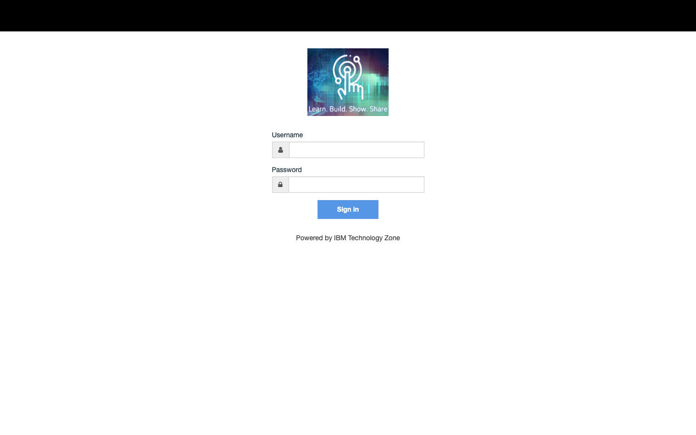

1. Open a **Private/Incognito** browser window.
2. On the instructor screen or printed sheet, find the **App ID Login URL** under *PART 1*:
   ```text
   https://cloud.ibm.com/authorize/<tenant_id>/<slug>
   ```
   Paste it into your browser's address bar and press Enter.
3. On the login page, enter your credentials from the instructor screen or printed sheet:
   - **Username**: the `App ID Username` line (e.g. `student3@abc123.techzone.com`)
   - **Password**: the `App ID Password` line
4. Click **Sign in**.

---

### 0.3 Step 2: Access Your Resources & Launch watsonx Orchestrate

1. In IBM Cloud, open your **Resource List** (`https://cloud.ibm.com/resources`) and expand **AI / Machine Learning**, or click into your provisioned **watsonx Orchestrate** service instance:

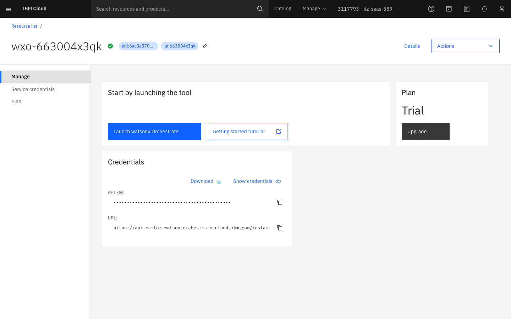

2. On the service instance overview page (shown above), click the blue **Launch watsonx Orchestrate** button.
3. You will be authenticated directly into your live **IBM watsonx Orchestrate workspace** dashboard:

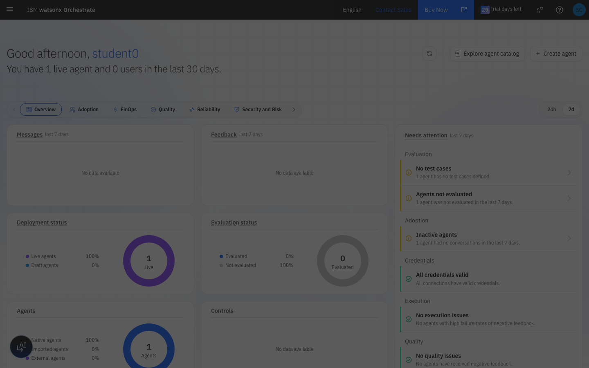

4. Here you can see your active agents, deployment status, and the floating **AI Chat trigger** in the bottom-left corner to converse with your agent.

---

### 0.4 Step 3: Copy Your WxO Instance URL from IBM Cloud

When Bob sets up your agent in Module 1, his **second question** will be your WxO Instance URL. **It is not on the instructor sheet — you copy it from IBM Cloud.** You are already on the right page from step 0.3.

1. In IBM Cloud, open your **watsonx Orchestrate** service instance (Resource List → **AI / Machine Learning** → your instance).

2. In the **Credentials** box, find the field labelled **URL** (not "API key"):


3. Click the **copy icon** to the right of the **URL** field. Use the copy icon rather than selecting the text — the field is too narrow to show the whole URL, so the visible text is cut off.

4. Keep it ready to paste when Bob asks. It starts with `https://api.` and ends with `/instances/` followed by a long ID, for example:
   ```text
   https://api.ca-tor.watson-orchestrate.cloud.ibm.com/instances/XXXX
   ```
   Your region (`ca-tor` here) may differ — paste exactly what IBM Cloud gives you.

> ⚠️ **Don't copy the "API key" field from this same box.** That is a different key and is not what Bob needs — you create the right one in step 0.5.

---

### 0.5 Step 4: Create Your IBM Cloud API Key for Bob

When Bob sets up your agent in Module 1, his **third question** will be your API key.

> ⚠️ **Use the key you create under IAM → API keys — not any other key.**
> Do **not** use the key created when you create the Service ID, and do **not** use the key shown on the watsonx Orchestrate instance page. The right one is: **Manage → Access (IAM) → API keys → Create**.

1. In IBM Cloud (the browser window you logged in to in Step 1), click **Manage** in the top navigation bar (red arrow below), then choose **Access (IAM)**.

2. In the left-hand menu, click **API keys**. This is **its own separate page** — it is not a tab inside the Service IDs page.

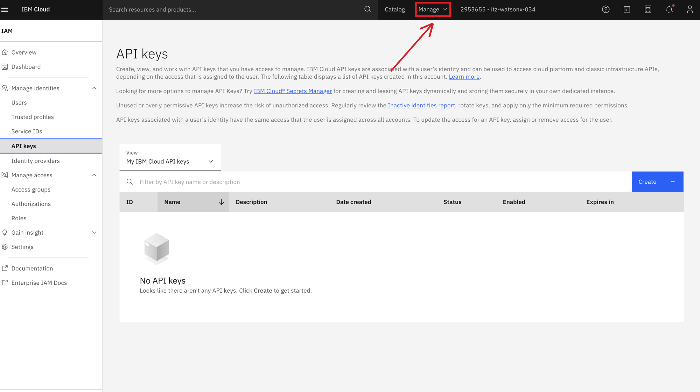

3. Click the blue **Create +** button on the right. In the dialog, enter a name (for example `Lab 2308 API Key`), leave the other options at their defaults, and click **Create**.

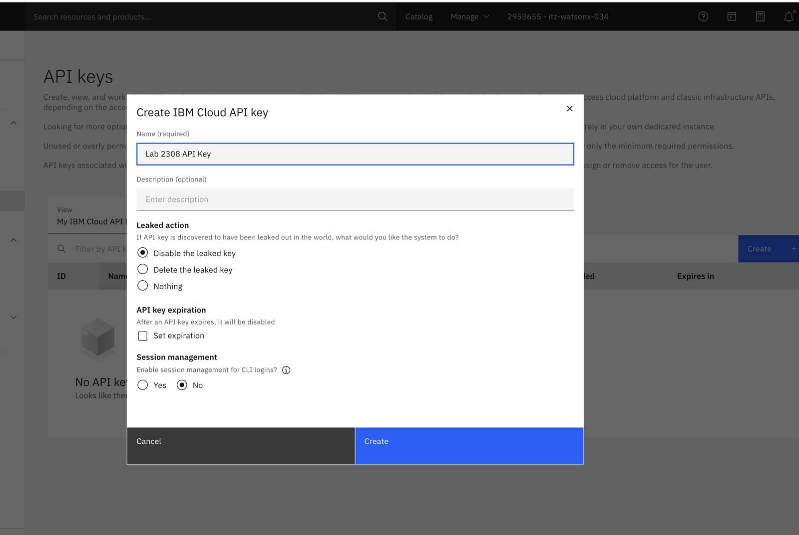

4. IBM Cloud shows the new key **only once**. Click **Copy** (or **Download**) and keep it ready to paste when Bob asks. It contains letters, numbers, underscores, and hyphens:
   ```text
   AbCdEfGhIjKlMnOpQrStUvWxYz0123456789AbCd_-x
   ```
   Copy just the key itself, not a label.

> **Lost the key?** It cannot be shown again. Click **Create +** and make another one.

---

### 0.6 Step 5: Find Your MCP Server URL for Bob

Bob's **first question** will be your OpenPages MCP Server URL.

1. On the instructor screen or printed sheet, find the line labelled **★ MCP SERVER URL** under *PART 2*:
   ```text
   https://wxgov-govconsole-demo-XXXX.vsi.techzone.ibm.com/mcp
   ```
   The `XXXX` part is a unique ID for your TechZone reservation.

2. Copy the full URL including `https://`.

3. Keep it ready to paste when Bob asks.

> **Can't find it on screen?** Take the **watsonx.Gov Application URL** from PART 2 and change `/openpages` at the end to `/mcp`. That's your MCP Server URL.

---

### 0.7 Step 6: Log In to OpenPages (for Module 2)

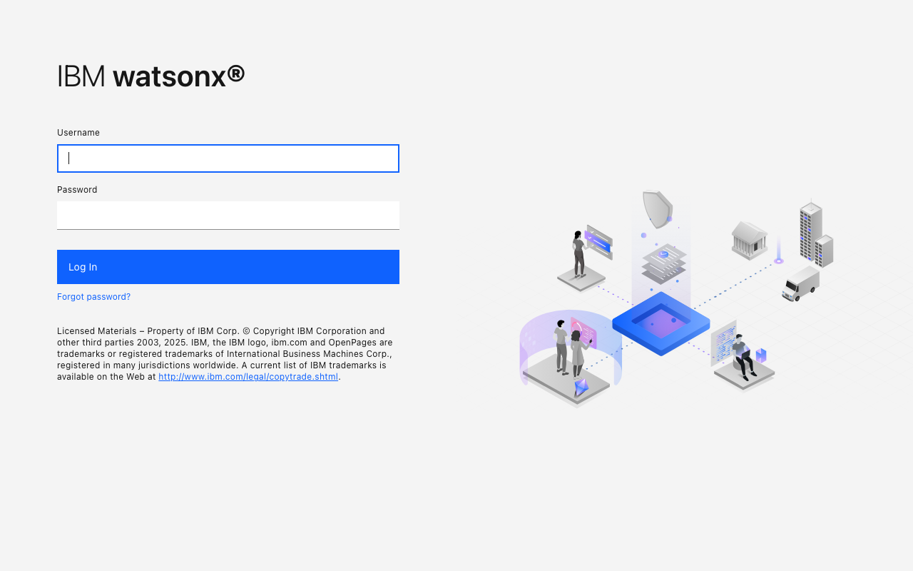

1. On the instructor screen or printed sheet, find the **watsonx.Gov Application URL** under *PART 2*:
   ```text
   https://wxgov-govconsole-demo-XXXX.vsi.techzone.ibm.com/openpages
   ```
2. Open this URL in your browser. You will see a browser security warning (TechZone uses a self-signed certificate):
   - Click **Advanced**
   - Click **Proceed to wxgov-govconsole... (unsafe)**
3. On the OpenPages login page, enter:
   - **Username**: `OpenPagesAdministrator`
   - **Password**: `passw0rd`
4. Click **Log In**.

> ⚠️ **Shared tenant reminder:** Multiple attendees share this WxO instance. Only create or modify assets named `lab2308_*`. Do not delete other attendees' agents or toolkits.

---

## 1.0 Module 1 — Start Here: Talk to Bob

**⏱ ~10 minutes**

This is where the magic happens. You will have a short conversation with Bob, share your environment details, and Bob will set up your entire agent stack while you watch.

### 1.1 Open IBM Bob

IBM Bob is an application installed on your lab machine (it does not run in a browser).

**Option A — Desktop icon:** double-click the **IBM Bob** icon on your desktop.

**Option B — No icon on the desktop (Windows):**
1. Click the **Start** button (Windows logo, bottom-left of the screen) or press the **Windows key**.
2. Type **Bob** — or click **All apps** and scroll to **IBM Bob**.
3. Click **IBM Bob** to launch it.

When Bob opens, choose **File → Open Folder** and open the `lab-2308` folder (your instructor will confirm where it is).

### 1.2 Sign In with Your IBM ID

After Bob launches, click **Sign in** and log in with your **IBM ID** (the same email you used to register for TechXchange).

### 1.3 Select the Lab Team

Bob must be using the lab team before it can run the lab setup.

1. Click the **gear icon** in the top-right corner of the Bob panel to open **Bob Settings**.
2. In the left menu, select **General**.
3. Next to **Team**, open the dropdown and select the lab team: **`IBM-TechXchange-2026 (region: us-east)`**. *(Your instructor will confirm if the team is named differently, for example `Lab-2308`.)*
4. Confirm the **checkmark** is next to the lab team.

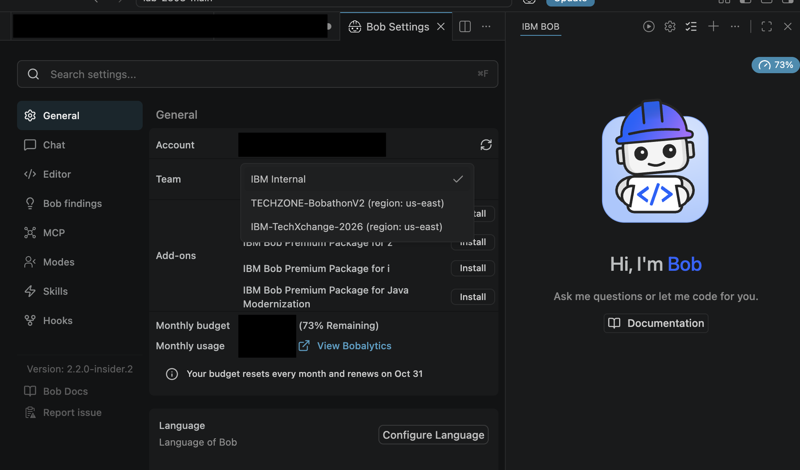

> ⚠️ The screenshot shows `IBM Internal` checked — that is the default. Change it to the lab team before continuing.

### 1.4 Check Your Python Version

Bob needs Python. **Bob checks this for you automatically** and installs it if it's missing, but it's worth confirming yourself:

- **Windows:** open the **Start** menu, search **Command Prompt**, and run `python --version`. If that fails, try `py --version`.
- **Mac:** open **Terminal** (**Cmd + Space**, type *Terminal*, press Enter) and run `python3 --version`.

You should see **Python 3.14.3**. Any Python from **3.11 to 3.14** also works. If Python is missing, just continue — Bob will install it for you in the next step (about 2 minutes).

### 1.5 Bob Sets Everything Up

Type this to start:

```
Hi Bob! I'm in Lab 2308 at TechXchange. Can you set me up?
```

Bob will greet you and ask for three things — one at a time (all three are covered in the [Prerequisites](#0-prerequisites--key-information-you-need-for-this-lab)):

1. **Your OpenPages MCP endpoint URL** (step 0.6)
   This is your OpenPages Application URL with `/openpages` replaced by `/mcp` (e.g. `https://wxgov-govconsole-demo-<reservation_id>.vsi.techzone.ibm.com/mcp`).

2. **Your watsonx Orchestrate Instance URL** (step 0.4)
   The **URL** field you copied from the Credentials box on your watsonx Orchestrate instance page in IBM Cloud.

3. **Your IBM Cloud API key** (step 0.5)
   The key you create under **Manage → Access (IAM) → API keys → Create** — not the key created with the Service ID.

> ⚠️ Always use the values from **your own** reservation. Bob never uses a shared key, instance or OpenPages server.

Once you confirm your details, Bob will say something like *"Give me a moment while I wire everything up..."* — and then silently:
- Connects to your WxO instance
- Registers an OpenPages MCP toolkit pointing at your TechZone environment
- Builds and imports your personalised risk agent

When Bob says **"🎉 You're all set!"**, your agent is live. Move on to Module 2.

> **If Bob asks you to run a single terminal command:** This only happens if one step needs a quick manual assist. Copy and paste the command exactly as Bob gives it, run it, then tell Bob "done" and he'll continue.

---

## 2.0 Module 2 — Explore OpenPages

**⏱ ~10 minutes**

Before chatting with the agent, spend a few minutes in the source system it will be querying.

### 2.1 Log In to OpenPages

1. Open your OpenPages URL (the one provided by your instructor — ending in `/openpages`).
2. Log in with the credentials provided (*Ask your lab instructors for credentials*).
3. Accept the browser security warning for the self-signed certificate (click **Advanced → Proceed**).

### 2.2 Find the Risk Records

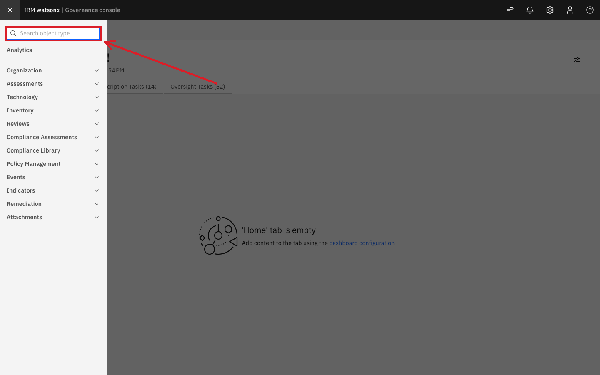

1. In the top-left corner, click the **Navigation Menu** (hamburger icon).
2. In the **Search object type** box (highlighted above), type **Risk** and click the **Risk** entry. There is no tab called "Risk register" — the object type is simply called **Risk**.
3. Notice the **Resource ID** format (e.g. `I01-RSK-01-01`). This is how the agent references individual risks.
4. Click into any risk record and look at the field names — notice they use prefixes like `OPSS-Rsk:Status`, `OPSS-Rsk:RiskLevel`. Your agent reads the schema at runtime to get these exact names — it never guesses.

---

## 3.0 Module 3 — Chat With Your Risk Agent

**⏱ ~25 minutes**

### 3.1 Open the Chat and Select Your Agent

> 🔗 **Back to watsonx Orchestrate:** open your IBM Cloud [Resource List](https://cloud.ibm.com/resources) → **AI / Machine Learning** → your **watsonx Orchestrate** instance → **Launch watsonx Orchestrate** (the same path as step 0.3). Tip: keep watsonx Orchestrate open in its own browser tab so you can switch back to it easily from OpenPages.

1. In the **left navigation bar**, click **Chat** (the speech bubble icon, second from the top).
   The chat drawer opens on the left side of the screen.

2. At the top of the chat drawer, click the **agent selector dropdown** — it may default to *"watsonx"* or *"AskOrchestrate"*. Select **`lab2308_risk_agent`** from the list.

3. Confirm the header shows **`lab2308_risk_agent`** before typing anything.

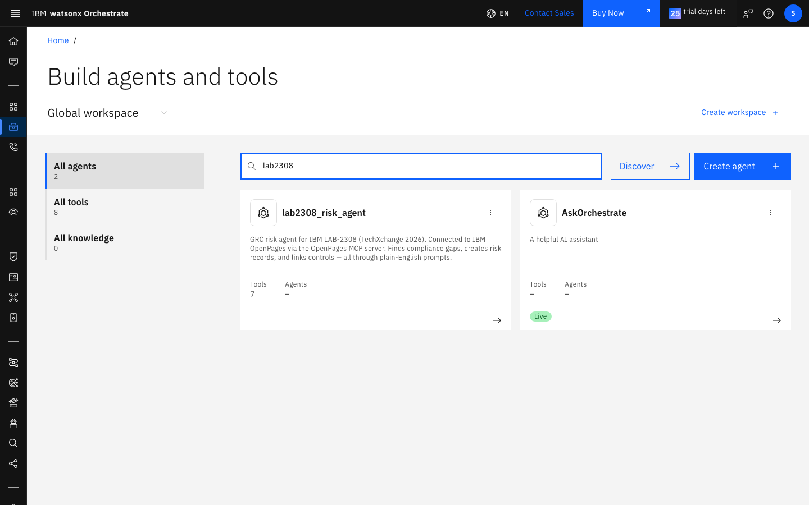

> ⚠️ **Make sure the dropdown says `lab2308_risk_agent`.** If it says *AskOrchestrate* or *watsonx*, it has no OpenPages tools and cannot answer your prompts — switch it before sending anything.
>
> ⚠️ **Traces are only recorded for the Live agent.** Bob already deployed it live. If traces are missing in Module 4, tell Bob: *"re-deploy my agent"*.

---

### 3.2 The Scenario: Find the Gap, Log the Risk, Link the Control

You are a risk analyst at a financial services firm. Every control in this environment is sitting at **"Awaiting Assessment"** — meaning no risk category has confirmed coverage. Your job:

1. **Find** which risk category is most exposed
2. **Log** a new risk in OpenPages to capture the gap
3. **Link** an existing control to the new risk to begin closing it

Work through the four prompts below in order.

---

#### Prompt 1 — Find the compliance gap

```
Which of our risk categories have controls that are still awaiting assessment?
Show me a breakdown by category with counts.
```

**What the agent does:**
- Reads the SOXRisk and SOXControl schemas (schema-first, every time)
- Queries all controls and checks their `OPSS-Ctl:Status` field
- Groups by risk category and counts unassessed controls per category

**What you'll see:** A markdown table of risk categories alongside how many controls are still "Awaiting Assessment" — every single one, which is your gap.

---

#### Prompt 2 — Explain the Gap

```
Explain the gap briefly.
```

**What the agent does:**
- Uses the data already retrieved in Prompt 1
- Identifies the top risk category by volume and notes the control assessment backlog

**What you'll see:** A short plain-English summary — which category is most exposed and how many controls are awaiting assessment.

> 💡 **Your "most exposed" category may differ from your neighbour's.** The answer depends on the data in your OpenPages environment, so seeing a category such as **Internal Fraud** (or any other) is expected and fine. Note which one the agent names — you can use it in Prompt 3.

---

#### Prompt 3 — Log a new risk for the gap

```
Log a new risk called "Unassessed Control Coverage — Client Products" in the
"Clients, Products and Business Practices" category. Add a description that
explains the compliance gap we just found.
```

> 💡 The prompt above works as written whichever category Prompt 2 named. If you'd rather log the risk against the category your agent reported as most exposed (e.g. Internal Fraud), swap that category name and a matching risk title into the prompt.

**What the agent does:**
- Calls `openpages_upsert_object` with the correct field names from the schema
- Places the risk under the Retail Banking business entity
- Returns the new Resource ID and a clickable link

**What you'll see:**
```
✅ Created: Unassessed Control Coverage — Client Products (Resource ID: XXXXX)
View in OpenPages: https://wxgov-govconsole-demo-<reservation_id>.vsi.techzone.ibm.com/...
```

> **Verify it live:** Click the link — you'll land directly on the new record in OpenPages. It's real data in the system.

---

#### Prompt 4 — Link a control to close the loop

```
Find a control related to client products and link it to the risk we just created.
```

**What the agent does:**
- Queries SOXControl records and picks a relevant one
- Calls `openpages_associate_objects` to create a Parent/Child relationship
- Returns the linked control name and a verification link

**What you'll see:**
```
✅ Linked: CTL-04-03-03-01 → Unassessed Control Coverage — Client Products
View control in OpenPages: https://wxgov-govconsole-demo-<reservation_id>.vsi.techzone.ibm.com/...
```

> **Verify it live:** Open the new risk record in OpenPages → **Controls** tab. The linked control appears there.

---

### 3.3 What the Agent Is Doing

Every response follows this sequence — invisible to you, but critical to why it works reliably:

```
Your message
    │
    ▼
1. get_resource("openpages://catalog/object_types")  ← What types exist?
    │
    ▼
2. get_resource("openpages://schema/SOXRisk")         ← What fields does this type have?
    │
    ▼
3. execute_openpages_query(SELECT confirmed fields…)  ← Query with verified field names only
    │
    ▼
4. Rewrite any internal opapp:10108 URLs             ← Clean up for display
    │
    ▼
5. Format and respond
```

This **schema-first pattern** is what separates a reliable enterprise AI agent from one that occasionally invents field names and returns errors. The schema check costs one extra tool call but eliminates an entire class of AI failure.

---

## 4.0 Module 4 — Inspect Live Telemetry & Execution Traces

**⏱ ~15 minutes**

In enterprise AI systems, observing *why* an agent made a decision and *how* it retrieved external data is critical for compliance and trust. watsonx Orchestrate captures every tool call, reasoning step, and response in a live trace you can inspect after each conversation.

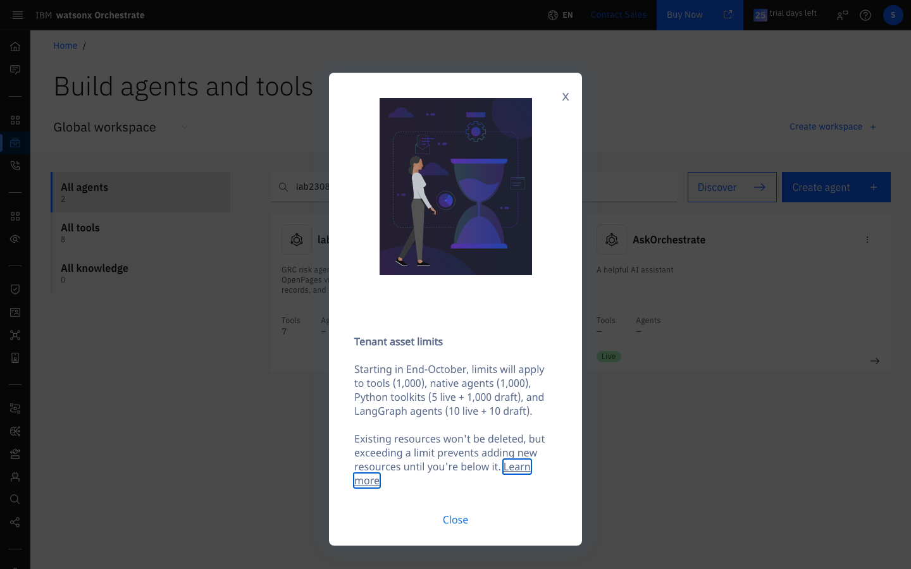

---

### 4.1 Open AgentOps Observability

1. In the **left navigation bar**, scroll down to the **AGENTOPS** section and click **Observability**.
2. On the Observability page, find and click **`lab2308_risk_agent`** in the agent list.
3. Click the **Conversations** tab to see every conversation the agent has had.
4. Find your conversation and click **Debug** on the right side of that row.
5. You will land on a **node / tree diagram** showing every step the agent took. Click any node to see the full input and output for that step — exact queries sent, raw JSON responses from OpenPages, and the model's reasoning.

---

### 4.2 Anatomy of an MCP Execution Trace

Each interaction in the trace inspector is broken down into structured execution spans:

| Span Type | Component | What It Reveals in the Trace |
|---|---|---|
| **TOOL (Schema Discovery)** | `openpages_get_resource` | The exact URI (`openpages://schema/SOXControl`) requested to introspect object fields before generating queries. |
| **TOOL (Data Query)** | `execute_openpages_query` | The exact SQL/REST query payload sent over MCP, execution duration (ms), HTTP status (200 OK), and row count. |
| **TOOL (Write / Association)** | `openpages_upsert_object` | The mutation payload sent to OpenPages, parent process ID binding, and the returned primary `resource_id`. |
| **LLM SPAN (Reasoning & Synthesis)** | `gpt-oss-120b` | ReAct reasoning steps, prompt/completion token counts, inference latency, and final response formatting. |

> 🔍 **Why This Matters:**
> Notice how the agent NEVER guessed field names like `status` or `risk_level`. The trace proves that `openpages_get_resource` was called first, ensuring field names (`OPSS-Ctl:Status`, `OPSS-Shared-Basel:Risk Category`) were 100% verified against the live OpenPages schema before the query executed.

---

### 4.3 Try Your Own Prompts & Watch the Traces

> ⚠️ **Go back to the Chat first.** You are currently in AgentOps Observability, which only *shows* past conversations — you can't type prompts there. To add the queries below, return to the **Chat** page: click **Chat** in the left navigation bar (second from the top), make sure **`lab2308_risk_agent`** is selected, and type each prompt in the chat box. Then come back to **Observability → Conversations → Debug** to inspect the new trace.

Pick at least two:

```
How many risks are currently in an Open status?
```

```
List risks that are High severity.
```

```
What controls are available in OpenPages?
```

```
Summarise the risk landscape — how many risks exist per status?
```

```
Which business entity has the most open risks?
```

For each, watch the trace. Ask yourself:
- Did the agent read the schema before querying?
- Are the field names in the query prefixed correctly (e.g. `OPSS-Rsk:Status`)?
- Do all links in the response point to your TechZone hostname?

---

## 5 Troubleshooting

**If something isn't working right, just tell Bob.** Bob has full visibility into your setup and can silently re-run any step. Example:

```
Bob, my risk agent isn't returning any results. Can you check the connection?
```

Bob will diagnose and fix it quietly.

---

**Common issues and what to say to Bob:**

| What you see | What to tell Bob |
|---|---|
| Agent says "I don't have access to that tool" | "Bob, my agent says it can't find the MCP tools. Can you re-register the toolkit?" |
| Responses time out | "Bob, the agent is timing out. Can you check the OpenPages endpoint?" |
| My traces are empty / missing | "Bob, please deploy my agent to live." Then open the **Live** agent and ask again. |
| Auth error / 401 | "Bob, I'm getting an authentication error. Can you refresh the connection?" |
| No risks returned | "Bob, the agent returned an empty list. My OpenPages URL is `<paste URL>`." |
| I don't see the lab team in the Team list | Sign out of Bob and sign in again with your IBM ID. If it's still missing, ask an instructor. |

---

## 6 Wrap-Up & Feedback

### What You Built

✅ An AI risk agent connected live to IBM OpenPages via MCP  
✅ Schema-first query behaviour — zero field-name hallucination  
✅ Natural language interface over a real GRC system  
✅ End-to-end tracing of agent tool calls  

### What Comes Next

Today's lab covers end-to-end risk management through an AI agent. The OpenPages MCP server also supports:

- **Creating risks** — `openpages_upsert_object` with a `SOXRisk` type
- **Linking controls** — `openpages_associate_objects`
- **Multi-step workflows** — e.g. "Create a risk, find the most relevant control, and link it"
- **Multi-agent patterns** — a parent orchestrator routing between a risk agent, an audit agent, and a policy agent

Future iterations of this lab cover write operations and multi-agent GRC workflows.

### Feedback

Please scan the QR code at your station or use the link your instructor provides to complete the session survey. Your feedback directly shapes future TechXchange lab content.

---

## 7 Reference

### Quick Links

| Resource | URL |
|---|---|
| WxO UI | Open from your IBM Cloud resource list → **Launch watsonx Orchestrate** (`https://<region>.watson-orchestrate.cloud.ibm.com`) |
| OpenPages UI | Your TechZone URL + `/openpages` |
| OpenPages 9.0 Docs | `https://www.ibm.com/docs/en/openpages/9.0.0` |
| OpenPages MCP GitHub | `https://github.com/IBM/ibm-openpages-mcp-server` |
| WxO Docs | `https://www.ibm.com/docs/en/watsonx-orchestrate` |

### MCP Tools on Your Agent

| Tool | What it does |
|---|---|
| `execute_openpages_query` | Runs SQL-style queries against OpenPages objects |
| `get_resource` | Fetches a schema or catalog resource (e.g. `openpages://schema/SOXRisk`) |
| `list_resources` | Lists all available MCP resource URIs |
| `openpages_upsert_object` | Creates or updates a GRC object |
| `openpages_associate_objects` | Links two objects (e.g. Control → Risk) |
| `openpages_dissociate_objects` | Removes a link between two objects |
| `openpages_delete_object` | Deletes a GRC object |
| `echo` | Tests MCP connectivity |

### OpenPages Object Types

| Type | Purpose | Key Fields |
|---|---|---|
| `SOXRisk` | Risk records | `OPSS-Rsk:Status`, `OPSS-Rsk:RiskLevel`, `OPSS-Rsk:Owner` |
| `SOXControl` | Control records | `OPSS-Ctl:Status`, `OPSS-Ctl:ControlType` |
| `SOXIssue` | Issue / finding records | `OPSS-Iss:Status`, `OPSS-Iss:Severity` |
| `Register` | Risk register (parent container) | `Name`, `Description` |

---

## Appendix A — Background

### A.1 About This Lab

GRC teams spend hours reading dashboards, chasing risk owners, and manually cross-referencing registers. What if an AI agent could answer questions about your risk posture — in plain English — by talking directly to your GRC system?

In this lab you will build exactly that: an **autonomous AI risk agent** powered by **IBM watsonx Orchestrate** that communicates with **IBM OpenPages** through the **OpenPages Model Context Protocol (MCP) server**.

The best part: **you don't write a single line of code, and you don't touch a terminal.** You simply tell IBM Bob what you need, and Bob handles every bit of wiring behind the scenes. By the time you walk into the watsonx Orchestrate UI, your agent is already built, connected, and ready to chat.

---

### A.2 Key Terms & Concepts

**IBM OpenPages**
IBM's GRC platform for managing operational risk, compliance, internal audit, and policy. Risk records (*SOXRisk*), controls (*SOXControl*), and issues (*SOXIssue*) live here.

**IBM watsonx Orchestrate (WxO)**
An agentic AI platform. Agents use natural language to plan actions and call tools. WxO handles reasoning, tool selection, and response generation automatically.

**Model Context Protocol (MCP)**
An open standard for exposing tools to AI agents. The IBM OpenPages MCP server wraps the entire OpenPages REST API as callable MCP tools — so a WxO agent can query risks, read schemas, and create records with no custom integration code.

**IBM Bob**
Your AI development assistant for this lab. Bob has a special skill loaded for Lab 2308 — when you tell him you're starting the lab and share your environment details, he silently wires up your entire agent stack, then hands you off to the WxO UI to start chatting.

---

### A.3 Lab Objectives

By the end of this lab you will be able to:

1. Explain how MCP bridges AI agents and enterprise GRC systems.
2. Describe the schema-first query pattern that prevents AI field-name hallucination.
3. Query live OpenPages risk data through a watsonx Orchestrate agent in natural language.
4. Trace the tool calls an agent makes to satisfy a user request.

---


### A.4 Architecture Overview

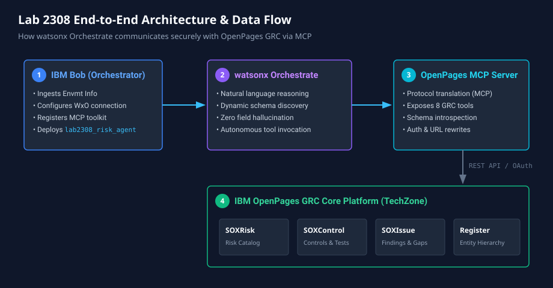

```
┌──────────────────────────────────────────────────────────────┐
│  Your Browser                                                 │
│                                                               │
│  ┌──────────────────────────────────────────────────────┐    │
│  │  watsonx Orchestrate Chat UI                          │    │
│  └─────────────────────┬────────────────────────────────┘    │
│                        │  natural language                    │
│                        ▼                                      │
│  ┌──────────────────────────────────────────────────────┐    │
│  │  lab2308_risk_agent                                   │    │
│  │  • Reads OpenPages schema before every query          │    │
│  │  • Never guesses field names                          │    │
│  │  • Rewrites internal Docker URLs automatically        │    │
│  └─────────────────────┬────────────────────────────────┘    │
│                        │  MCP tool calls                      │
└────────────────────────┼─────────────────────────────────────┘
                         │
             ┌───────────▼──────────────────┐
             │  OpenPages MCP Server         │
             │  (running in your TechZone)   │
             │  8 tools exposed via MCP      │
             └───────────┬──────────────────┘
                         │  OpenPages REST API
                         ▼
             ┌──────────────────────────────┐
             │  IBM OpenPages GRC            │
             │  SOXRisk · SOXControl ·       │
             │  SOXIssue · Register          │
             └──────────────────────────────┘
```

**What Bob does behind the scenes (invisible to you):**
- Installs the watsonx Orchestrate ADK
- Registers your OpenPages environment as an MCP toolkit in WxO
- Builds and imports the risk agent with your environment's URLs baked in

---

---

## Notices and Disclaimers

© 2026 International Business Machines Corporation. No part of this document may be reproduced or transmitted in any form without written permission from IBM.

U.S. Government Users Restricted Rights — use, duplication or disclosure restricted by GSA ADP Schedule Contract with IBM.

IBM, the IBM logo, and ibm.com are trademarks of International Business Machines Corporation, registered in many jurisdictions worldwide. A current list of IBM trademarks is available at [www.ibm.com/legal/copytrade.shtml](https://www.ibm.com/legal/copytrade.shtml).

*IBM TechXchange 2026 / © 2026 IBM Corporation*

---

---

*IBM TechXchange 2026 / Lab 2308 / © 2026 IBM Corporation*
